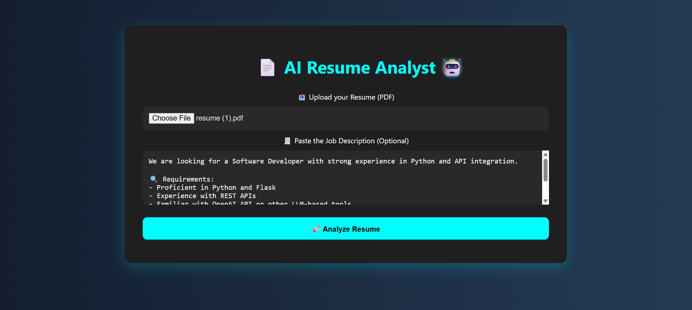
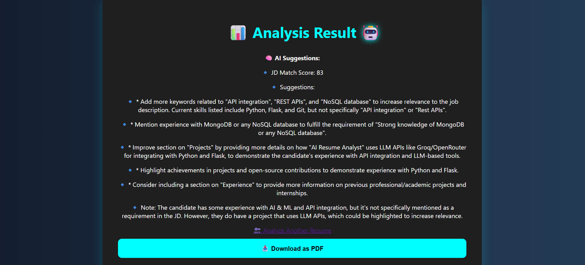

# 📄 AI Resume Analyst

A smart, modern AI-powered Flask web app that:

* 🧠 Analyzes uploaded resumes using LLaMA 3 via Groq API
* 📊 Calculates Job Description (JD) match score
* ✍️ Rewrites bullet points with AI
* 📎 Exports results to PDF
* 🌀 Includes stylish animations, spinners, and emojis

---

## 🚀 Features

* **📤 Upload Resume** (PDF only)
* **🧾 Paste Job Description** (optional)
* **💡 AI Feedback**: Formatting, layout, grammar, wording
* **📊 JD Match Score**: AI compares your resume with the JD
* **✍️ Bullet Point Rewriter**: Smarter, action-based phrasing
* **📎 PDF Export**: Get downloadable result file
* **🌀 Spinner & Glow Effects**: Sleek frontend feel

---

## ⚙️ Built With

* **Python** (Flask)
* **Groq API** (LLaMA 3)
* **PyMuPDF** for PDF parsing
* **HTML/CSS/JavaScript**
* **JS Spinner + Emoji-enhanced UI**

---

## 📦 How To Run

1. Clone the repo

   ```bash
   git clone https://github.com/Anupam11421/ai-resume-analyst.git
   cd ai-resume-analyst
   ```

2. Create and activate virtual environment:

   ```bash
   python -m venv venv
   venv\Scripts\activate   # Windows
   ```

3. Install requirements:

   ```bash
   pip install -r requirements.txt
   ```

4. Add your Groq API key to `.env`:

   ```env
   GROQ_API_KEY=your_key_here
   ```

5. Run the app:

   ```bash
   python app.py
   ```

6. Visit: [http://localhost:5000](http://localhost:5000)

---

## 🌟 Screenshots





---

## 🧠 Why This Project?

This project was built to showcase real-world AI integration in resume evaluation. Whether you're preparing for MAANG or startups, this tool helps you:

* Stand out in interviews
* Improve resume quality
* Tailor resumes to JDs quickly

---

## 🙌 Credits

Made with ❤️ by [Anupam Tiwari](https://github.com/Anupam11421) — aiming to build real-world, resume-worthy AI projects.

💬 DM Me On

🔗 [LinkedIn](https://www.linkedin.com/in/anupam-tiwari-08607b281/)
🧑‍💻 [GitHub](https://github.com/Anupam11421)

Let’s cook something epic 👨‍🍳🔥

⭐ Support & Contribution
If you like this project, please give it a ⭐
Open to contributions, suggestions, and improvements!
